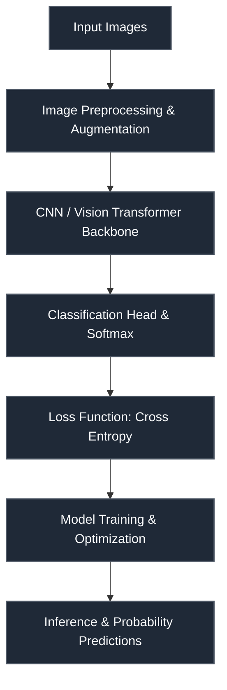

# Corporación Favorita — Store Sales Time Series Forecasting

 

> **Host:** [`Corporación Favorita`]  
> **Platform Link:** [Kaggle Competition](https://www.kaggle.com/competitions/store-sales-time-series-forecasting)  
> **Dataset Link:** [Kaggle Dataset](https://www.kaggle.com/competitions/store-sales-time-series-forecasting/data)  
> **Domain:** `Retail Demand Forecasting`

## Overview

This repository contains the developmental workspace and notebooks for the **Corporación Favorita — Store Sales Time Series Forecasting** project. The primary focus of this project is in the domain of **Retail Demand Forecasting** on Corporación Favorita. The codebase represents an iterative implementation of machine learning pipelines, structured to process datasets, train models, and validate predictions.

### Project Context

categorical_columns = x.select_dtypes(include=['object']).columns.tolist(). encoder = OneHotEncoder(sparse_output=False). one_hot_encoded = encoder.fit_transform(x[categorical_columns]).

### Technical Methodology & Implementation

The codebase features a total of 513 cells across 50 notebook(s). The system implements several key architectural elements:
- **Core Classes**: Custom object-oriented structures are defined to manage state and logic, including: `EC_NET`, `ENCODER`, `EffnetModel`, `RF_NET`, `high_regressor`.
- **Key Algorithms & Utilities**: Procedural helpers and utilities facilitate operations, notably: `__init__`, `forward`, `process_calendar`, `weights_init`.
- **Training & Optimization**: Includes optimization via Adam.

## System Architecture

## Notebook Architecture

### Inference & Submission

| Notebook / Script | Type | Versions | Average Size | Core Stack / Techniques |
| :--- | :--- | :--- | :--- | :--- |
| **EfficientNet_LSTM_Inference** | Multi-Version Script | [v1](./Inference%20%26%20Submission/EfficientNet_LSTM_Inference/v1.ipynb), [v2](./Inference%20%26%20Submission/EfficientNet_LSTM_Inference/v2.ipynb), [v3](./Inference%20%26%20Submission/EfficientNet_LSTM_Inference/v3.ipynb), [v4](./Inference%20%26%20Submission/EfficientNet_LSTM_Inference/v4.ipynb), [v5](./Inference%20%26%20Submission/EfficientNet_LSTM_Inference/v5.ipynb), [v6](./Inference%20%26%20Submission/EfficientNet_LSTM_Inference/v6.ipynb), [v7](./Inference%20%26%20Submission/EfficientNet_LSTM_Inference/v7.ipynb), [v8](./Inference%20%26%20Submission/EfficientNet_LSTM_Inference/v8.ipynb), [v9](./Inference%20%26%20Submission/EfficientNet_LSTM_Inference/v9.ipynb), [v10](./Inference%20%26%20Submission/EfficientNet_LSTM_Inference/v10.ipynb), [v11](./Inference%20%26%20Submission/EfficientNet_LSTM_Inference/v11.ipynb), [v12](./Inference%20%26%20Submission/EfficientNet_LSTM_Inference/v12.ipynb), [v13](./Inference%20%26%20Submission/EfficientNet_LSTM_Inference/v13.ipynb), [v14](./Inference%20%26%20Submission/EfficientNet_LSTM_Inference/v14.ipynb), [v15](./Inference%20%26%20Submission/EfficientNet_LSTM_Inference/v15.ipynb), [v16](./Inference%20%26%20Submission/EfficientNet_LSTM_Inference/v16.ipynb), [v17](./Inference%20%26%20Submission/EfficientNet_LSTM_Inference/v17.ipynb), [v18](./Inference%20%26%20Submission/EfficientNet_LSTM_Inference/v18.ipynb), [v19](./Inference%20%26%20Submission/EfficientNet_LSTM_Inference/v19.ipynb), [v20](./Inference%20%26%20Submission/EfficientNet_LSTM_Inference/v20.ipynb), [v21](./Inference%20%26%20Submission/EfficientNet_LSTM_Inference/v21.ipynb), [v22](./Inference%20%26%20Submission/EfficientNet_LSTM_Inference/v22.ipynb), [v23](./Inference%20%26%20Submission/EfficientNet_LSTM_Inference/v23.ipynb), [v24](./Inference%20%26%20Submission/EfficientNet_LSTM_Inference/v24.ipynb), [v25](./Inference%20%26%20Submission/EfficientNet_LSTM_Inference/v25.ipynb), [v26](./Inference%20%26%20Submission/EfficientNet_LSTM_Inference/v26.ipynb), [v27](./Inference%20%26%20Submission/EfficientNet_LSTM_Inference/v27.ipynb) | 14 KB | OpenCV, PyTorch |
| **Inference** | Multi-Version Script | [v1](./Inference%20%26%20Submission/Inference/v1.ipynb), [v2](./Inference%20%26%20Submission/Inference/v2.ipynb), [v3](./Inference%20%26%20Submission/Inference/v3.ipynb), [v4](./Inference%20%26%20Submission/Inference/v4.ipynb), [v5](./Inference%20%26%20Submission/Inference/v5.ipynb), [v6](./Inference%20%26%20Submission/Inference/v6.ipynb) | 25 KB | OpenCV, PyTorch, Scikit-Learn |
| **LSTM_Inference** | Multi-Version Script | [v1](./Inference%20%26%20Submission/LSTM_Inference/v1.ipynb), [v2](./Inference%20%26%20Submission/LSTM_Inference/v2.ipynb), [v3](./Inference%20%26%20Submission/LSTM_Inference/v3.ipynb), [v4](./Inference%20%26%20Submission/LSTM_Inference/v4.ipynb), [v5](./Inference%20%26%20Submission/LSTM_Inference/v5.ipynb), [v6](./Inference%20%26%20Submission/LSTM_Inference/v6.ipynb), [v7](./Inference%20%26%20Submission/LSTM_Inference/v7.ipynb), [v8](./Inference%20%26%20Submission/LSTM_Inference/v8.ipynb), [v9](./Inference%20%26%20Submission/LSTM_Inference/v9.ipynb), [v10](./Inference%20%26%20Submission/LSTM_Inference/v10.ipynb), [v11](./Inference%20%26%20Submission/LSTM_Inference/v11.ipynb), [v12](./Inference%20%26%20Submission/LSTM_Inference/v12.ipynb), [v13](./Inference%20%26%20Submission/LSTM_Inference/v13.ipynb), [v14](./Inference%20%26%20Submission/LSTM_Inference/v14.ipynb), [v15](./Inference%20%26%20Submission/LSTM_Inference/v15.ipynb), [v16](./Inference%20%26%20Submission/LSTM_Inference/v16.ipynb), [v17](./Inference%20%26%20Submission/LSTM_Inference/v17.ipynb) | 22 KB | OpenCV, PyTorch, Scikit-Learn |

## Navigation Guidelines

> **Stage Guidelines**
>
- **EDA & Preprocessing**: Verify data loaders and inspect class distributions before model design.
- **Training & Validation**: Check training runs, loss curves, and model validation scores to evaluate performance.
- **Inference & Ensembling**: Run predictions on testing files and verify submission formatting.

---

> "We count the transactions of today, blind to the black swans of tomorrow."
>
> — **Vigneshwaran S**
