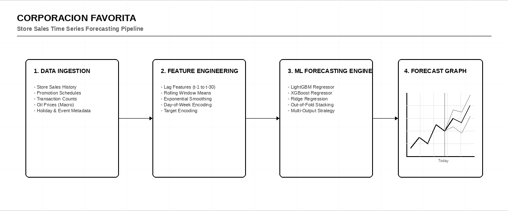

# 🛒 Corporación Favorita — Store Sales Time Series Forecasting

    

> [!IMPORTANT]
> **Host:** `Corporación Favorita`  
> **Platform Link:** [Kaggle Competition](https://www.kaggle.com/competitions/store-sales-time-series-forecasting)  
> **Dataset Link:** [Kaggle Dataset](https://www.kaggle.com/competitions/store-sales-time-series-forecasting/data)  
> **Domain:** `Retail Demand Forecasting`

## 📖 Overview

Classic sales forecasting challenge. I built models to predict sales across retail stores in Ecuador using multivariate time series techniques and external regressors.

## ⚙️ Standard Pipeline Workflow

## 🗂️ Notebook Architecture & Inventory

### 📂 Inference & Submission
*Prediction pipeline and Kaggle submission file generation.*

| Script / Notebook | Type | Versions | Average Size | Core Stack / Techniques |
|:------------------|:-----|:---------|:-------------|:------------------------|
| 📁 **EfficientNet_LSTM_Inference** | Multi-Version Script | [v1](./Inference%20%26%20Submission/EfficientNet_LSTM_Inference/v1.ipynb), [v10](./Inference%20%26%20Submission/EfficientNet_LSTM_Inference/v10.ipynb), [v11](./Inference%20%26%20Submission/EfficientNet_LSTM_Inference/v11.ipynb), [v12](./Inference%20%26%20Submission/EfficientNet_LSTM_Inference/v12.ipynb), [v13](./Inference%20%26%20Submission/EfficientNet_LSTM_Inference/v13.ipynb), [v14](./Inference%20%26%20Submission/EfficientNet_LSTM_Inference/v14.ipynb), [v15](./Inference%20%26%20Submission/EfficientNet_LSTM_Inference/v15.ipynb), [v16](./Inference%20%26%20Submission/EfficientNet_LSTM_Inference/v16.ipynb), [v17](./Inference%20%26%20Submission/EfficientNet_LSTM_Inference/v17.ipynb), [v18](./Inference%20%26%20Submission/EfficientNet_LSTM_Inference/v18.ipynb), [v19](./Inference%20%26%20Submission/EfficientNet_LSTM_Inference/v19.ipynb), [v2](./Inference%20%26%20Submission/EfficientNet_LSTM_Inference/v2.ipynb), [v20](./Inference%20%26%20Submission/EfficientNet_LSTM_Inference/v20.ipynb), [v21](./Inference%20%26%20Submission/EfficientNet_LSTM_Inference/v21.ipynb), [v22](./Inference%20%26%20Submission/EfficientNet_LSTM_Inference/v22.ipynb), [v23](./Inference%20%26%20Submission/EfficientNet_LSTM_Inference/v23.ipynb), [v24](./Inference%20%26%20Submission/EfficientNet_LSTM_Inference/v24.ipynb), [v25](./Inference%20%26%20Submission/EfficientNet_LSTM_Inference/v25.ipynb), [v26](./Inference%20%26%20Submission/EfficientNet_LSTM_Inference/v26.ipynb), [v27](./Inference%20%26%20Submission/EfficientNet_LSTM_Inference/v27.ipynb), [v3](./Inference%20%26%20Submission/EfficientNet_LSTM_Inference/v3.ipynb), [v4](./Inference%20%26%20Submission/EfficientNet_LSTM_Inference/v4.ipynb), [v5](./Inference%20%26%20Submission/EfficientNet_LSTM_Inference/v5.ipynb), [v6](./Inference%20%26%20Submission/EfficientNet_LSTM_Inference/v6.ipynb), [v7](./Inference%20%26%20Submission/EfficientNet_LSTM_Inference/v7.ipynb), [v8](./Inference%20%26%20Submission/EfficientNet_LSTM_Inference/v8.ipynb), [v9](./Inference%20%26%20Submission/EfficientNet_LSTM_Inference/v9.ipynb) | `Avg 13 KB` | `PyTorch, OpenCV` |
| 📁 **Inference** | Multi-Version Script | [v1](./Inference%20%26%20Submission/Inference/v1.ipynb), [v2](./Inference%20%26%20Submission/Inference/v2.ipynb), [v3](./Inference%20%26%20Submission/Inference/v3.ipynb), [v4](./Inference%20%26%20Submission/Inference/v4.ipynb), [v5](./Inference%20%26%20Submission/Inference/v5.ipynb), [v6](./Inference%20%26%20Submission/Inference/v6.ipynb) | `Avg 25 KB` | `PyTorch, OpenCV` |
| 📁 **LSTM_Inference** | Multi-Version Script | [v1](./Inference%20%26%20Submission/LSTM_Inference/v1.ipynb), [v10](./Inference%20%26%20Submission/LSTM_Inference/v10.ipynb), [v11](./Inference%20%26%20Submission/LSTM_Inference/v11.ipynb), [v12](./Inference%20%26%20Submission/LSTM_Inference/v12.ipynb), [v13](./Inference%20%26%20Submission/LSTM_Inference/v13.ipynb), [v14](./Inference%20%26%20Submission/LSTM_Inference/v14.ipynb), [v15](./Inference%20%26%20Submission/LSTM_Inference/v15.ipynb), [v16](./Inference%20%26%20Submission/LSTM_Inference/v16.ipynb), [v17](./Inference%20%26%20Submission/LSTM_Inference/v17.ipynb), [v2](./Inference%20%26%20Submission/LSTM_Inference/v2.ipynb), [v3](./Inference%20%26%20Submission/LSTM_Inference/v3.ipynb), [v4](./Inference%20%26%20Submission/LSTM_Inference/v4.ipynb), [v5](./Inference%20%26%20Submission/LSTM_Inference/v5.ipynb), [v6](./Inference%20%26%20Submission/LSTM_Inference/v6.ipynb), [v7](./Inference%20%26%20Submission/LSTM_Inference/v7.ipynb), [v8](./Inference%20%26%20Submission/LSTM_Inference/v8.ipynb), [v9](./Inference%20%26%20Submission/LSTM_Inference/v9.ipynb) | `Avg 22 KB` | `PyTorch, OpenCV` |

---

## 🚀 Navigation & Usage Guidelines

> [!TIP]
> 1. **EDA & Preprocessing**: Verify data loaders, actigraphy or DICOM image transformations before model training.
> 2. **Training & Optimization**: Check model definition parameters and training logs to reproduce network weights.
> 3. **Inference & Post-Processing**: Run final pipelines to verify predictions and check submission formats.

---

> *"We count the transactions of today, blind to the black swans of tomorrow."*
>
> — **Vigneshwaran S**
